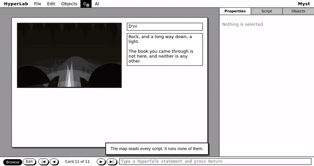
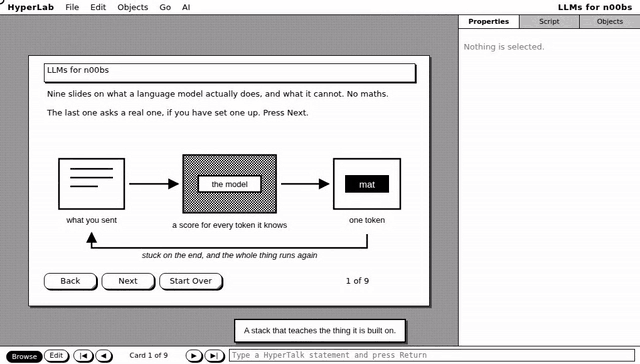

<p align="center">
  
</p>

<p align="center">
  <a href="https://github.com/JGalego/HyperLab/actions/workflows/ci.yml"></a>
  <a href="LICENSE"></a>
  
  
  <a href="CONTRIBUTING.md"></a>
</p>

[HyperCard](https://en.wikipedia.org/wiki/HyperCard) let people who never
called themselves programmers build real software: draw a card, put a button
on it, write two lines of script, and it runs. HyperLab is what that idea
looks like thirty years on, with language models built into the way a stack
thinks rather than bolted onto the side of one.

Cards, stacks, fields, buttons, scripts and message passing are all still
here, and a stack stays inspectable and editable while it runs — the two
qualities that made the original worth learning in the first place.


---

## 📑 Contents

- [🚀 Getting Started](#getting-started)
- [🃏 Examples](#examples)
- [🏗️ How It Is Put Together](#how-it-is-put-together)
- [🤖 Where the AI Goes](#where-the-ai-goes)
- [🤝 Contributing](#contributing)
- [📄 Licence](#licence)

---

<h2 id="getting-started">🚀 Getting Started</h2>

🖥️ **The application** — a `.dmg`, an `.msi`, and a `.deb`, `.rpm` or
`.AppImage`, on the
[releases page](https://github.com/JGalego/HyperLab/releases). Nothing phones
home, and HyperLab works with no AI provider configured.

📦 **Prebuilt tools** — detects your OS/architecture automatically and
installs both `hyperlab-mcp` (serves a stack over MCP, so Claude Desktop or
any other client can drive it) and `hyperlab-graph` (draws a stack, or reports
what is wrong with it):

```sh
# 🐧 Linux / 🍎 macOS (x86_64 or arm64)
curl -fsSL https://raw.githubusercontent.com/JGalego/HyperLab/main/install.sh | sh

# 🪟 Windows (x86_64), in PowerShell
irm https://raw.githubusercontent.com/JGalego/HyperLab/main/install.ps1 | iex
```

🦀 **From source** (needs [Rust](https://rustup.rs) 1.88):

```sh
cargo install --git https://github.com/JGalego/HyperLab hyperlab-mcp
cargo install --git https://github.com/JGalego/HyperLab hyperlab-graph
```

🔨 **Building the application** — needs 🦀 Rust 1.88, 🟢
[Node](https://nodejs.org) 20, and
[Tauri's system dependencies](https://tauri.app/start/prerequisites/):

```sh
git clone https://github.com/JGalego/hyperlab
cd hyperlab
```

```sh
cargo test
```

```sh
cd apps/desktop
npm install
npm run tauri dev
```

Then open one of the [examples](#examples).

---

<h2 id="examples">🃏 Examples</h2>

<p align="center">
  
</p>

**Cluedo** — a drawn mansion with clickable rooms, portraits that are
themselves the buttons, and a case you close by deduction.

<p align="center">
  
</p>

**Myst** — an island, four Ages, and one book you should not open. Its
shape is the point, which is why [DeMystify](https://github.com/glthr/DeMystify)
and [mystextract](https://github.com/erkyrath/mystextract) both exist to
recover it from the original. **Go ▸ Map** finds the trap book without
running a line.

<p align="center">
  
</p>

**LLMs for n00bs** — nine slides on how a language model works, drawn one bit
deep. The last one asks a real model, and says so plainly when none is set up.

**Address Book** — a card per person, one shared background.

**Recipe Box** — chunk expressions doing arithmetic on the ingredients.

**Todo** — a list, a dialog, and a loop.

```sh
cargo run -p hyperlab-persistence --example build_examples
```

---

<h2 id="how-it-is-put-together">🏗️ How It Is Put Together</h2>

```
UI  →  Commands  →  Runtime  →  Model  →  Renderer
```

One rule holds the design up: **nothing changes a stack except a command.**
The interface, a script and an AI assistant all reach a stack through that
one path in, so undo, scripting, automation, testing and AI all work the
same way — a change made by any of them looks like a change made by any
other.

```
crates/
    stack/          the object model      — what a stack is
    parser/         lexer, parser, AST    — what the author wrote
    runtime/        commands, dispatch,
                    the interpreter       — what it means
    persistence/    the .hl bundle        — where it is kept
    ai/             provider interfaces   — who is asked
    ai-providers/   OpenAI and Anthropic
                    clients               — how they are reached
    assistant/      prompts, the tool
                    loop, the transcript  — what is actually said
    mcp/            tools, MCP server
                    and client            — what may be done
    graph/          the routes between
                    cards                 — where it all leads

apps/desktop/       the Tauri shell and the React renderer
docs/               architecture, roadmap, HyperTalk reference
examples/           six stacks, which are also tests
```

`hyperlab-parser` depends on nothing at all, so the language can be tested and
reused on its own. The desktop shell contains no logic worth the name.

- **Behaviour is HyperTalk.** `put it & return after field "Items"`, and
  `put ai("Summarize this") into field "Summary"` — a model is part of the
  language, not a panel beside it. Edit a script and it takes effect at once;
  there is no build step inside a stack.
- **A stack is a directory.** One `.json` per card and scripts kept as plain
  `.hypertalk` files rather than escaped inside JSON, so a stack diffs,
  merges and greps like source code.
- **A stack is also a graph.** Owning the parser means every `go` can be read
  back out, so **Go ▸ Map** draws the whole thing and names the cards nothing
  leads to, the cards with no way out, and the links pointing at a card that
  was deleted last week. `hyperlab-graph <stack.hl>` writes the same reading
  as Graphviz, or as a report that fails a build.

Read [`docs/architecture.md`](docs/architecture.md) for the reasoning, and
[`docs/hypertalk.md`](docs/hypertalk.md) for the language.

---

<h2 id="where-the-ai-goes">🤖 Where the AI Goes</h2>

The code is arranged so these hold on their own:

- **No provider is special.** A provider implements
  [`AiProvider`](crates/ai/src/provider.rs) and nothing in HyperLab switches
  on which one it is. OpenAI, Anthropic, Google, Ollama, OpenRouter and local
  models are just names in a settings file. The clients live in
  [their own crate](crates/ai-providers), which the rest of HyperLab does
  not depend on; one of them speaks the OpenAI chat-completions protocol, so
  pointing a `baseUrl` at Ollama or a local server is all it takes to run
  with no network at all. A key goes into the keychain your operating system
  already runs, or into an environment variable you name; the settings file
  records which, and never the key.
- **An assistant can do exactly what you can do.** It works through
  [MCP tools](crates/mcp) that wrap runtime commands, so everything it does
  is undoable and visible. There is no private back door into a stack.
- **Nothing leaves without a reason.** HyperLab is local-first, works with no
  provider configured, and the [context builder](crates/ai/src/context.rs)
  omits your field contents unless a question actually needs them. The
  sidebar shows the exact text it sent with every question.

There are three ways in, and they are the same machinery underneath: `ai(…)`
and `ask assistant` in [a script](docs/hypertalk.md#asking-a-language-model),
the sidebar, and [MCP](crates/mcp) — `hyperlab-mcp --stack Todo.hl` hands the
same tools to any client that speaks the protocol, read-only until you say
otherwise.

---

<h2 id="contributing">🤝 Contributing</h2>

Please do — see [CONTRIBUTING.md](CONTRIBUTING.md) and the
[Code of Conduct](CODE_OF_CONDUCT.md). The [roadmap](docs/roadmap.md) lists
good places to start.

<h2 id="licence">📄 Licence</h2>

[MIT](LICENSE).

HyperLab is an original work inspired by HyperCard. It contains no Apple code
and no Apple artwork, and the Neo Classic theme is drawn from scratch in the
spirit of the era.
